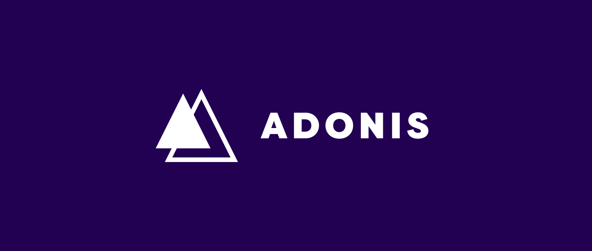

# Curso AdonisJS da RocketSeat - Skylab

Construir uma API-Only com AdonisJS e utilizando os principais métodos de uma aplicação básica, como criação de usuários, controle de autenticação, recuperação de passoword, relacionamentos entre models, validação de dados e os devidos CRUDs destes models e etc.

<p align="center">
  
</p>

Abaixo segue o link da plataforma de cursos Skylab, onde este projeto faz parte do Curso Bônus de AdonisJS
https://skylab.rocketseat.com.br/

## Adonis API application

This is the boilerplate for creating an API server in AdonisJs, it comes pre-configured with.

1. Bodyparser
2. Authentication
3. CORS
4. Lucid ORM
5. Migrations and seeds

## Setup

Use the adonis command to install the blueprint

```bash
adonis new yardstick --api-only
```

or manually clone the repo and then run `npm install`.


### Migrations

Run the following command to run startup migrations.

```js
adonis migration:run
```

### Run Server to Environment Developer

Run the following command to run serve Adonis in URL: "http://127.0.0.1:3333"

```js
adonis serve --dev
```

### All credits this project for RocketSeat Cursos
